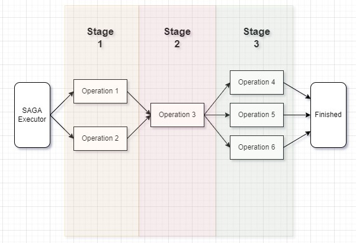

# Other Library Possibilities

There are some other usage possibilities. This doc is an explanation of advanced features.

## Premature Transaction Finishing
Sometimes you need to stop execution of operations in a transaction.
I.e. you have tried to create an entity in external microservice, but it is already there.
You have received an error, however you understand somehow (for example you can determine it receiving HTTP response status)
that it is absolutely ok and you have nothing left to do.

So, you want to stop execution of a transaction - this is what `ITransactionContext.FinishPrematurely()` stands for!
You can use it in any commit method of any operation:
```c#
public override Task CommitAsync(CancellationToken cancellationToken)
{
    // you logic here
    // await ...

    // calling premature finish of transaction
    _transactionContext.FinishPrematurely();
}
```

## Other Transaction and Operation settings
Most of other settings could be set up using `[DistributedTransactionOperation]` attribute parameters.
Please, explore parameters to understand the possibilities.

### Operation Rollback Priority
**!Attention!** Important thing is that order you register operations in a `SagaExecutor` is the same order operations are committed.
If you want to change *commiting* order, just change order of registration.

However you can not really control the rollback priority - this is what `RollbackPriority` parameter stands for.
The bigger value of `RollbackPriority` is, the latter operation rollback will be executed.

This can be specified as a named argument of an attribute:
```c#
[DistributedTransactionOperation(
            transactionType: "my-transaction",
            operationType: "my-operation",
            RollbackPriority = 1)]
```

Please, don't set it as `0` - it will not be set explicitly, because it is a default value.
It will be identified as *not passed parameter* (== null).
This is an implementation detail due to attribute parameter restrictions. [You can read about it here](https://docs.microsoft.com/en-us/dotnet/csharp/language-reference/language-specification/attributes#positional-and-named-parameters)

Operations are selected using basic *SQL SELECT*:
```sql
select * from distributed_transaction_operation
ORDER BY rollback_priority;
```

### Operation Parallel Committing
Imagine you have a transaction with 6 operations inside, but you can not lose time and commit some of operations at the same time.

At this time you can create **stages** - different steps in committing process.
And you can assign operations to different stages. It can be done using named parameter `ExecutionStage` of an `[DistributedTransactionOperation]`.

This can be specified as a named argument of an attribute:
```c#
[DistributedTransactionOperation(
            transactionType: "my-transaction",
            operationType: "my-operation",
            ExecutionStage = 1)]
```

Please, don't set it as `0` - it will not be set explicitly, because it is a default value.
It will be identified as *not passed parameter* (== null).
This is an implementation detail due to attribute parameter restrictions. [You can read about it here](https://docs.microsoft.com/en-us/dotnet/csharp/language-reference/language-specification/attributes#positional-and-named-parameters)

Below is the diagram, where there are 6 operations and 3 stages:
- №1 and №2 have the same *execution_stage* value
- №3 have the another unique *execution_stage* value
- №4, №5, №6 have again the same *execution_stage* value

The lower *execution_stage* is, the earlier it will be executed.


## Retries
Surely, there are some actions that can fail on the first execution and then succeed.
So here comes the retry mechanism - it is implemented using [Polly](https://github.com/App-vNext/Polly).

**By default retries are turned OFF**!

You can setup default settings passing a special parameter to serviceCollection extension method:
```c#
services.AddSaga(retryPolicy: new RetryPolicy
{
    IsTurnedOn = true, // turns retries on and off
    RollbackRetryCount = 3, // amount of retries for any rollback method
    CommitRetryCount = 3 // amount of retries for any commit method
})
```

But if you want to change retry policy specifically for single transaction, you can use [DistributedTransactionSettings](../src/DistributedTransactions/Models/Settings/DistributedTransactionSettings.cs) class and set your own retry policy. Then you need to create a builder by yourself:
```c#
return new SagaExecutorBuilder(distributedTransactionSettings)
    .AddLogger(logger)
    .AddTransactionContext(transactionContext)
    .AddOperationProvider(operationProvider)
    .AddTransactionProvider(transactionProvider)
    .AddMetricsSender(metricsSender);
```

Then you can build a `sagaExecutor` now and that's all.
By now settings specific retry policy on a single operation in a transaction is not supported.

## Metrics
If you are using `UsePlatform` method in a `Program.cs` main method of your service (and you do), you are adding `Aer.Platform.Metrics` library
and you can send metrics to a Prometheus server. `DistributedTransactions` library gets your service name and sends metrics when any transaction or operation changes it status.
Afterwards you can find metrics of your service working with distributed transactions.
